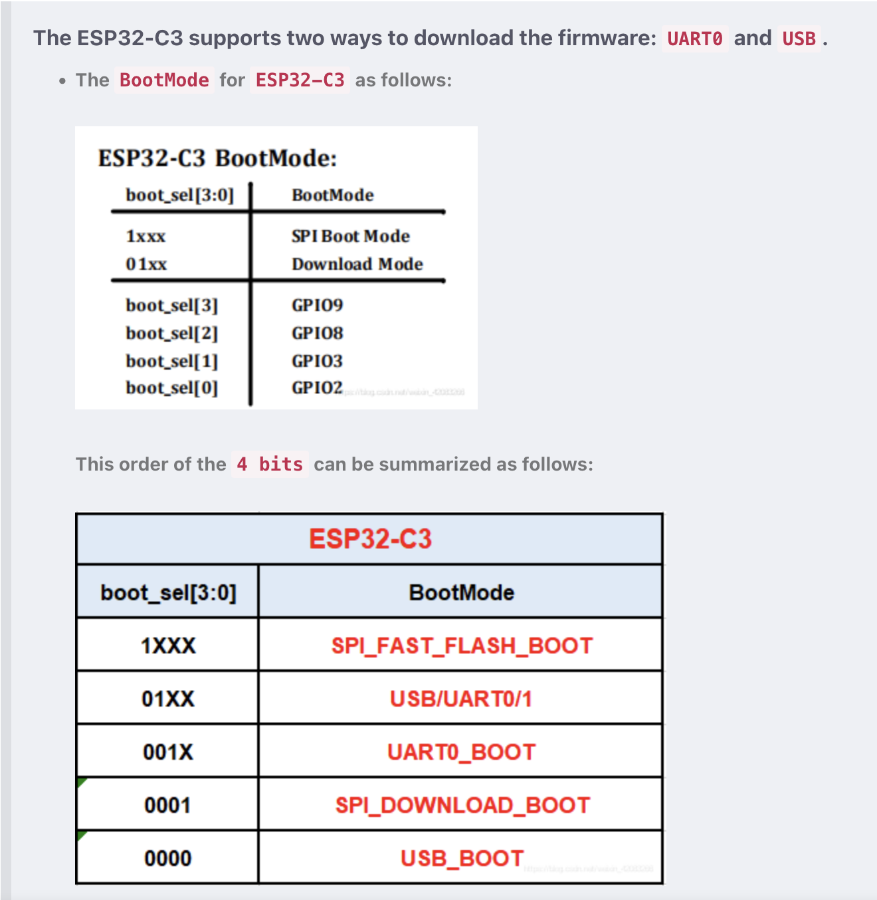

## Build firmware for f1c200s

`make build`

## Update build firmware for esp-hosted-ng solution

0. enter `src/esp-hosted/esp_hosted_ng/esp/esp_driver`

1. run `cmake .` to setup enviornment, it will setup esp-idf as submodule to be used by `network_adapter`

2. setup compiling environment by `cd esp-idf && . ./export.sh` in esp-idf directory

3. In the `network_adapter` directory of this project, input command `idf.py set-target esp32-c3` to set target.

4. Use `idf.py build` to recompile `network_adapter` and generate new firmware.

ESP32-c3 flash



## Checks

Power sources :
Need to tight OE to 5v 
3v3 : OK
5v : OK
2.5v : OK
1.1v : OK

Communication with ESP32-C2 : OK
Used Arduino + UART, after pressing the reset button on the board, the ESP32-C2 sends a message on the UART.
Problem : Unable to flash esp32-c3, the boot mode by default tries to download the firmware from the USB and not the UART. It seems that the mode can be changed by modifying GPIO8 pin. and pull this GPIO down.

Flashing SPI Nand requires to modify the u-boot-with-spl.bin. This can be done by using the mknandboot.sh script. This is script is located in mds_external/board/mds_network_player and it comes from 
- https://github.com/bamkrs/openwrt/blob/dolphinpi-spinand/target/linux/sunxi/image/gen_sunxi_spinand_onlyboot_img.sh
- https://github.com/TiNredmc/u-boot/blob/v2020/f1c100_uboot_spinand.sh
- https://tinlethax.wordpress.com/2021/04/11/lichee-pi-nano-with-w25n01gv-support-complete-guide/

SPL is booting correctly after executing f1c100_uboot_spinand.sh on u-boot-with-spl.bin. But it doesn't detect the 2nd stage after this. 
That means that BootROM is able to load the SPL and run it, but SPI NAND boot is not supported completely in the SPL itself.
Different solution has been pushed to mailing list : https://patchwork.ozlabs.org/project/uboot/cover/20221014030520.3067228-1-uwu@icenowy.me/

Another one that looks supporting NAND boot : https://github.com/TiNredmc/u-boot/commits/v1.0

9/02/2024 : Boot fro SPI nand is ok
Problem was that mknans=dboot.sh was incorrect. This script split the SPL to be loaded correctly by the BootROM. This was working, but after the bootROM, the SPL itself were not able to load u-boot payload. This has been fixed by correcting the script to load the u-boot size at the correct address.

To flash the SPI NAND, the following command can be used : 

load the u-boot-with-spl.bin in fel mode and write the output ok mknand.sh to address 0x80000000. This is the start of the RAM : 
./sunxi-fel -p uboot images/u-boot-sunxi-with-spl.bin write 0x80000000 images/spi-nand.bin

On a serial console, u-boot starts. The following command can be used to flash the SPI NAND :
```
mtd erase boot ; mtd write.raw boot 0x80000000
```
Then the board can be rebooted and the u-boot will boot from the SPI NAND.: 
```
reset
```


### UBI NOK
```
ubiformat /dev/mtd1
ubiattach -p /dev/mtd1
ubimkvol /dev/ubi0 -N rootfs -m
mount -t ubifs ubi:rootfs /mnt/


umount /mnt
ubidetach -p /dev/mtd1
```

In u-boot
Error mounting ubifs partition + super slow to attache ubi 
```
=> ubi part rootfs
ubi0: attaching mtd2
ubi0: scanning is finished
ubi0: attached mtd2 (name "rootfs", size 127 MiB)
ubi0: PEB size: 131072 bytes (128 KiB), LEB size: 126976 bytes
ubi0: min./max. I/O unit sizes: 2048/2048, sub-page size 2048
ubi0: VID header offset: 2048 (aligned 2048), data offset: 4096
ubi0: good PEBs: 1016, bad PEBs: 0, corrupted PEBs: 0
ubi0: user volume: 1, internal volumes: 1, max. volumes count: 128
ubi0: max/mean erase counter: 1/0, WL threshold: 4096, image sequence number: 1738062171
ubi0: available PEBs: 0, total reserved PEBs: 1016, PEBs reserved for bad PEB handling: 20
=> ubi info l
Volume information dump:
        vol_id          0
        reserved_pebs   992
        alignment       1
        data_pad        0
        vol_type        3
        name_len        6
        usable_leb_size 126976
        used_ebs        992
        used_bytes      125960192
        last_eb_bytes   126976
        corrupted       0
        upd_marker      0
        skip_check      0
        name            rootfs
Volume information dump:
        vol_id          2147479551
        reserved_pebs   2
        alignment       1
        data_pad        0
        vol_type        3
        name_len        13
        usable_leb_size 126976
        used_ebs        2
        used_bytes      253952
        last_eb_bytes   2
        corrupted       0
        upd_marker      0
        skip_check      0
        name            layout volume
=> ubi     
  ubi ubifsload ubifsls ubifsmount ubifsumount
=> ubi
  ubi ubifsload ubifsls ubifsmount ubifsumount
=> ubi
  ubi ubifsload ubifsls ubifsmount ubifsumount
=> ubifsmount rootfs
UBIFS error (pid: 1): cannot open "rootfs", error -22
Error reading superblock on volume 'rootfs' errno=-22!
=> ubifsmount ubi0:rootfs
UBIFS error (ubi0:0 pid 0): validate_sb: bad superblock, error 13
        magic          0x6101831
        crc            0x83e6525
        node_type      6 (superblock node)
        group_type     0 (no node group)
        sqnum          2
        len            4096
        key_hash       0 (R5)
        key_fmt        0 (simple)
        flags          0x8
        big_lpt        0
        space_fixup    0
        min_io_size    2048
        leb_size       126976
        leb_cnt        992
        max_leb_cnt    992
        max_bud_bytes  5713920
        log_lebs       4
        lpt_lebs       2
        orph_lebs      2
        jhead_cnt      1
        fanout         8
        lsave_cnt      256
        default_compr  3
        rp_size        5242880
        rp_uid         0
        rp_gid         0
        fmt_version    5
        time_gran      1000000000
        UUID           83bc6bac
Error reading superblock on volume 'ubi0:rootfs' errno=-22!

```


ubi0: attaching mtd1
ubi0: scanning is finished
ubi0: empty MTD device detected
ubi0: attached mtd1 (name "rootfs", size 127 MiB)
ubi0: PEB size: 131072 bytes (128 KiB), LEB size: 126976 bytes
ubi0: min./max. I/O unit sizes: 2048/2048, sub-page size 2048
ubi0: VID header offset: 2048 (aligned 2048), data offset: 4096
ubi0: good PEBs: 1016, bad PEBs: 0, corrupted PEBs: 0
ubi0: user volume: 0, internal volumes: 1, max. volumes count: 128
ubi0: max/mean erase counter: 0/0, WL threshold: 4096, image sequence number: 1578400881
ubi0: available PEBs: 992, total reserved PEBs: 24, PEBs reserved for bad PEB handling: 20
ubi0: background thread "ubi_bgt0d" started, PID 218
UBIFS error (pid: 229): cannot open "ubi:rootfs", error -19
ubi: mtd1 is already attached to ubi0


=> ubi part rootfs 2048
ubi0: attaching mtd2
ubi0: scanning is finished
ubi0: attached mtd2 (name "rootfs", size 127 MiB)
ubi0: PEB size: 131072 bytes (128 KiB), LEB size: 126976 bytes
ubi0: min./max. I/O unit sizes: 2048/2048, sub-page size 2048
ubi0: VID header offset: 2048 (aligned 2048), data offset: 4096
ubi0: good PEBs: 1016, bad PEBs: 0, corrupted PEBs: 0
ubi0: user volume: 1, internal volumes: 1, max. volumes count: 128
ubi0: max/mean erase counter: 3/2, WL threshold: 4096, image sequence number: 1562993607
ubi0: available PEBs: 0, total reserved PEBs: 1016, PEBs reserved for bad PEB handling: 20


#### UBI in linux : 
Ok if everything is done from the target. ubiformating, volume creation and mounting
But if trying to ubiupdatemkvol with ubifs created fron buildroot, it's not I got this error : 
```
root LMDS@/mnt/user# mount -t ubifs ubi:rootfs-a /mnt/rootfs-a
[ 2650.990000] UBIFS (ubi0:0): Mounting in unauthenticated mode
[ 2651.000000] UBIFS error (ubi0:0 pid 141): 0xc0239930: LEB size mismatch: 129024 in superblock, 126976 real
[ 2651.010000] UBIFS error (ubi0:0 pid 141): 0xc0239940: bad superblock, error 1
[ 2651.020000] 	magic          0x6101831
[ 2651.020000] 	crc            0x9c2c3bcf
[ 2651.020000] 	node_type      6 (superblock node)
[ 2651.030000] 	group_type     0 (no node group)
[ 2651.030000] 	sqnum          10881
[ 2651.040000] 	len            4096
[ 2651.040000] 	key_hash       0 (R5)
[ 2651.040000] 	key_fmt        0 (simple)
[ 2651.050000] 	flags          0x0
[ 2651.050000] 	big_lpt        0
[ 2651.050000] 	space_fixup    0
[ 2651.060000] 	min_io_size    2048
[ 2651.060000] 	leb_size       129024
[ 2651.060000] 	leb_cnt        397
[ 2651.070000] 	max_leb_cnt    2048
[ 2651.070000] 	max_bud_bytes  8388608
[ 2651.070000] 	log_lebs       5
[ 2651.080000] 	lpt_lebs       2
[ 2651.080000] 	orph_lebs      1
[ 2651.080000] 	jhead_cnt      1
[ 2651.090000] 	fanout         8
[ 2651.090000] 	lsave_cnt      256
[ 2651.090000] 	default_compr  1
[ 2651.100000] 	rp_size        0
[ 2651.100000] 	rp_uid         0
[ 2651.100000] 	rp_gid         0
[ 2651.110000] 	fmt_version    4
[ 2651.110000] 	time_gran      1000000000
[ 2651.110000] 	UUID           D9E29025-9B19-4531-AC50-AC54716A2606
mount: mounting ubi:rootfs-a on /mnt/rootfs-a failed: Invalid argument
```

More specifically this error `LEB size mismatch: 129024 in superblock, 126976 real`. Looks like there is size mismatch ?

In buildroot the Filesystem images menu configured ubifs like this : 

LEB size : 0x1f800 = 129024
Reasl is 0x1F000 = 126976

Try to change buildroot size with this value and **OK**

### ubiupdatebol
```
ubiattach -p /dev/mtd1
ubiupdatevol /dev/ubi0_0 /tmp/rootfs.ubifs
```

### FASTMAP
enable FASTMAP in u-boot :

on linux :
```
# ubiattach -p /dev/mtd1
[   52.620000] ubi0: default fastmap pool size: 50
[   52.620000] ubi0: default fastmap WL pool size: 25
[   52.630000] ubi0: attaching mtd1
```


### Configure ether

modprobe g_ether
ifconfig usb0 192.168.2.2

### Mass Storage NOK
```
modprobe g_mass_storage iSerialNumber=123456 file=/mnt/fat32.part stall=0 removable=1

losetup /dev/loop0 /mnt/fat32.part


``` 
### After u-boot config changes :

Boot FEL ok
Boot from NAND ok but not after hard reboot
reset cmd not working :
```
=> reset
resetting ...
System reset not supported on this platform
### ERROR ### Please RESET the board ###
```
bootm cmd not working :
```
=> bootm 0x80000000
Wrong Image Type for bootm command
ERROR -91: can't get kernel image!
```

Add support for FIT image and now OK !


### PS1
```
PS1='\[\e[0;31m\]\u\[\e[m\] \[\e[0;32m\]\h\[\e[m\]@\[\e[0;3
4m\]\w\[\e[m\]\$ '
```

# Possible usage

## Wall switch

with round screen SPI + lvgl : wall switch usage
+ rotary knob


## Binky

with screen SPI + app lvgl : Internet radio + spotify

## SDK for music application

- Airplay 2
- Spotify Connect

TODO : 

Update rootfs-a / rootfs-b
Save u-boot environment in NAND

## Respeaker 2

https://wiki.seeedstudio.com/ReSpeaker_2_Mics_Pi_HAT/
### button

BUTTON: a User Button, connected to GPIO17 -> PD6 on f1c200s => GPIO 102 (4(D) * 32 - 1 ) + 6 = 102

```
gpio-event-mon -n gpiochip0 -o 102 -r -f -b 10000
```


# DMA : 
Not supported fdor f1c200s. similiar to a10 DMA but needs patches.
Found patches here : https://linux-sunxi.narkive.com/3zRXUcrE/rfc-patch-00-10-add-support-for-dma-and-audio-codec-of-f1c100s#post13

For audio i2s : support for f1c200s is not available in mainline kernel. but there is some code coming from allwinner :
Based on this page, suniv f1200s is sun3iw1.
There is a https://github.com/SoCXin/H6/blob/dde0a40608fd962a419b2a543a36166cfeb01d04/linux/kernel/sound/soc/sunxi/sun3iw1_daudio.c#L828 driver
That might be close to the sun50iw1p1 one which is A64/H64 architecture. 
Driver for A64 is mainline : 


## I2S


## dev kernel :

build :
```shell
make build-linux-rebuild 
```

copy to target :
```shell
scp -O /workspace/build/output/network_player/images/uImage root@192.168.2.2:/boot
```

copy module : 
```shell
scp -O /workspace/build/output/network_player/target/lib/modules/6.7.2/kernel/sound/soc/sunxi/sun4i-spdif.ko root@192.168.2.2://usr/lib/modules/6.7.2/kernel/sound/soc/sunxi/sun4i-spdif.ko
```

## NanoHat-SPDIF
EXT SPDIF :
https://github.com/Irdroid/NanoHat-SPDIF/blob/main/Hardware/Eagle%20Design/NanoHat-SPDIF.pdf

## F-OTA

Firmware OTA strategy:
Split the NAND in 5 partitions :

| Name           |  Size    | mtd  | Size (Hex)  | Offset (Hex) |
|----------------|----------|------|-------------|--------------|
| Boot           |   1 MB   | mtd0 |  0x0100000  |  0x0000000   |
| FOTA           |   15 MB  | mtd1 |  0x0f00000  |  0x0100000   |
| System         |   56 MB  | mtd2 |  0x3800000  |  0x1000000   |
| Data           |   56 MB  | mtd3 |  0x3800000  |  0x4800000   |
| Sum            |  128 MB  |      |  0x8000000  |              |


System consist of 2 buildroot configuration.
One configuration for FOTA system and another one for regular rootfs.

FOTA system is used to update the system. It is stored in the FOTA partition. it contains an initramfs.
The initramfs is minimal and contains only the necessary tools to update the system. as well as a script shell that run as init.

rootfs is the regular system. It is stored in the System partition. It contains the full system. This configuration builds all the component of the systemm execpt the FOTA initramfs. It builds
- u-boot
- kernel
- rootfs

When the system boots, it first run the SPL and the u-boot store on the first partition of the NAND.
U-boot check the FOTA nand partition and the rootfs partition. It loads the initranfs from the FOTA and the kernel from the rootfs. It then boot the system.
The kernel boots and starts the FOTA initramfs. The fota script starts, if it found a new firmware to update in the DATA partion, it updates the system. It then reboots the system.
If not it will mount rootfs, switch root and start the regular system.

After a bootstrap, to generate all the partitions fron the uImage + rootfs FOTA run :

- format fota partition
`ubiformat /dev/mtd1`

- format rootfs partition
`ubiformat /dev/mtd2`

- format data partition
`ubiformat /dev/mtd3`

- attach all partitions
```
ubiattach -p /dev/mtd1
ubiattach -p /dev/mtd2
ubiattach -p /dev/mtd3
```

- Generate partitions 
```
ubimkvol /dev/ubi0 -N fota -m
ubimkvol /dev/ubi1 -N rootfs -m
ubimkvol /dev/ubi2 -N data -m
mkdir /mnt/fota /mnt/rootfs /mnt/data 

mount -t ubifs /dev/ubi0_0    /mnt/fota
mount -t ubifs /dev/ubi1_0    /mnt/rootfs
mount -t ubifs /dev/ubi2_0    /mnt/data
```

- copy rootfs.ubifs to data partition
```
scp -O out/rootfs.ubifs mds:/mnt/data/rootfs.ubifs
```

- copy uImage to fota partition
```
scp -O out/fota/uImage mds:/mnt/fota/uImage
scp -O out/fota/uboot.env mds:/mnt/fota/uboot.env
scp -O out/fota/suniv-f1c200s-mds-network-streamer-v1.0.dtb mds:/mnt/fota/suniv-f1c200s-mds-network-streamer-v1.0.dtb

```


- update the rootfs :
 ubiattach -p /dev/mtd1
 ubiupdatevol /dev/ubi1_0 /mnt/data/rootfs.ubifs
 


ubiattach -p /dev/mtd1
ubimkvol /dev/ubi0 -N rootfs -m
mount -t ubifs ubi:rootfs /mnt/

# Manufacture du Son line up

## DAC + streamer


## Binky

## Radio


# Boot Time

16/06/2024 : arround 24s


```
[0.000001 0.000001]
[0.000174 0.000173] U-Boot SPL 2024.04 (Jun 01 2024 - 19:42:07 +0000)
[0.003046 0.002872] DRAM: 64 MiB
[0.013565 0.010519] Trying to boot from sunxi SPI
[0.013919 0.000354] sunxi_get_spl_size() = 16384
[0.018922 0.005003] load_offset = 32768
[0.019099 0.000177] spi0_nand_reset()
[0.019256 0.000157] Found U-Boot image
[0.946437 0.927181] load() success 0
[0.947155 0.000718] spl_spi_try_load() success
[0.947874 0.000719] spi0_deinit()
[1.072169 0.124295]
[1.072252 0.000083]
[1.072267 0.000015] U-Boot 2024.04 (Jun 01 2024 - 19:42:07 +0000) Allwinner Technology
[1.077430 0.005163]
[1.077446 0.000016] CPU:   Allwinner F Series (SUNIV)
[1.077874 0.000428] Model: La Manufacture du Son - Network Streamer
[1.093482 0.015608] DRAM:  64 MiB
[1.141137 0.047655] Core:  27 devices, 16 uclasses, devicetree: separate
[1.147937 0.006800] WDT:   Not starting watchdog@1c20ca0
[1.154028 0.006091] MMC:
[1.154110 0.000082] Loading Environment from nowhere... OK
[1.154342 0.000232] In:    serial
[1.163492 0.009150] Out:   serial
[1.163592 0.000100] Err:   serial
[1.163669


```
[0.000001 0.000001]
[0.000174 0.000173] U-Boot SPL 2024.04 (Jun 01 2024 - 19:42:07 +0000)
[0.003046 0.002872] DRAM: 64 MiB
[0.013565 0.010519] Trying to boot from sunxi SPI
[0.013919 0.000354] sunxi_get_spl_size() = 16384
[0.018922 0.005003] load_offset = 32768
[0.019099 0.000177] spi0_nand_reset()
[0.019256 0.000157] Found U-Boot image
[0.946437 0.927181] load() success 0
[0.947155 0.000718] spl_spi_try_load() success
[0.947874 0.000719] spi0_deinit()
[1.072169 0.124295]
[1.072252 0.000083]
[1.072267 0.000015] U-Boot 2024.04 (Jun 01 2024 - 19:42:07 +0000) Allwinner Technology
[1.077430 0.005163]
[1.077446 0.000016] CPU:   Allwinner F Series (SUNIV)
[1.077874 0.000428] Model: La Manufacture du Son - Network Streamer
[1.093482 0.015608] DRAM:  64 MiB
[1.141137 0.047655] Core:  27 devices, 16 uclasses, devicetree: separate
[1.147937 0.006800] WDT:   Not starting watchdog@1c20ca0
[1.154028 0.006091] MMC:
[1.154110 0.000082] Loading Environment from nowhere... OK
[1.154342 0.000232] In:    serial
[1.163492 0.009150] Out:   serial
[1.163592 0.000100] Err:   serial
[1.163669 0.000077] Hit any key to stop autoboot:  0
[2.170596 1.006927] ## Info: input data size = 42 = 0x2A
[2.172140 0.001544] Failed to import environment from 0x80000000, run regular boot
[2.177116 0.004976] SPI speeed : 50000000
[2.303583 0.126467] ubi0: attaching mtd3
[3.135506 0.831923] ubi0: scanning is finished
[3.163249 0.027743] ubi0: attached mtd3 (name "rootfs", size 56 MiB)
[3.163702 0.000453] ubi0: PEB size: 131072 bytes (128 KiB), LEB size: 126976 bytes
[3.168925 0.005223] ubi0: min./max. I/O unit sizes: 2048/2048, sub-page size 2048
[3.174276 0.005351] ubi0: VID header offset: 2048 (aligned 2048), data offset: 4096
[3.179780 0.005504] ubi0: good PEBs: 448, bad PEBs: 0, corrupted PEBs: 0
[3.184883 0.005103] ubi0: user volume: 1, internal volumes: 1, max. volumes count: 128
[3.190198 0.005315] ubi0: max/mean erase counter: 10/8, WL threshold: 4096, image sequence number: 1252219457
[3.200880 0.010682] ubi0: available PEBs: 2, total reserved PEBs: 446, PEBs reserved for bad PEB handling: 20
[3.498889 0.298009] ** File not found .run.ota **
[3.499952 0.001063] No OTA update found
[3.500515 0.000563] Loading file '/boot/uImage' to addr 0x80000000...
[7.186956 3.686441] Done
[7.187302 0.000346] Loading file '/boot/suniv-f1c200s-mds-network-streamer-v1.0.dtb' to addr 0x80fe0000...
[7.200570 0.013268] Done
[7.200655 0.000085] ## Booting kernel from Legacy Image at 80000000 ...
[7.205696 0.005041]    Image Name:   Linux-6.9.2
[7.206120 0.000424]    Image Type:   ARM Linux Kernel Image (uncompressed)
[7.211238 0.005118]    Data Size:    5102704 Bytes = 4.9 MiB
[7.216363 0.005125]    Load Address: 82000000
[7.216620 0.000257]    Entry Point:  82000000
[7.231677 0.015057]    Verifying Checksum ... OK
[7.366337 0.134660] ## Flattened Device Tree blob at 80fe0000
[7.366645 0.000308]    Booting using the fdt blob at 0x80fe0000
[7.371788 0.005143] Working FDT set to 80fe0000
[7.371989 0.000201]    Loading Kernel Image to 82000000
[7.441710 0.069721]    Loading Device Tree to 81e55000, end 81e5a4d1 ... OK
[7.442031 0.000321] Working FDT set to 81e55000
[7.457466 0.015435] DE is present but not probed
[7.473635 0.016169]
[7.473660 0.000025] Starting kernel ...
[7.473763 0.000103]
[10.631697 3.157934] [    0.000000] Booting Linux on physical CPU 0x0
[10.633457 0.001760] [    0.000000] Linux version 6.9.2 (build@b93b341c5157) (arm-buildroot-linux-musleabi-gcc.br_real (Buildroot 2024.02.2) 12.3.0, GNU ld (GNU Binutils) 2.40) #1 Sat Jun  1 13:50:12 UTC 2024
[10.648288 0.014831] [    0.000000] CPU: ARM926EJ-S [41069265] revision 5 (ARMv5TEJ), cr=0005317f
[10.658570 0.010282] [    0.000000] CPU: VIVT data cache, VIVT instruction cache
[10.663918 0.005348] [    0.000000] OF: fdt: Machine model: MDS Network Streamer v1.0
[10.669343 0.005425] [    0.000000] Memory policy: Data cache writeback
[10.674678 0.005335] [    0.000000] Zone ranges:
[10.674857 0.000179] [    0.000000]   Normal   [mem 0x0000000080000000-0x0000000083ffffff]
[10.680321 0.005464] [    0.000000] Movable zone start for each node
[10.685657 0.005336] [    0.000000] Early memory node ranges
[10.690929 0.005272] [    0.000000]   node   0: [mem 0x0000000080000000-0x0000000083ffffff]
[10.696456 0.005527] [    0.000000] Initmem setup node 0 [mem 0x0000000080000000-0x0000000083ffffff]
[10.701971 0.005515] [    0.000000] Kernel command line: ubi.mtd=2 root=ubi0:rootfs rootfstype=ubifs rootwait rw console=ttyS0,115200
[10.712801 0.010830] [    0.000000] Dentry cache hash table entries: 8192 (order: 3, 32768 bytes, linear)
[10.718267 0.005466] [    0.000000] Inode-cache hash table entries: 4096 (order: 2, 16384 bytes, linear)
[10.728788 0.010521] [    0.000000] Built 1 zonelists, mobility grouping on.  Total pages: 16256
[10.734250 0.005462] [    0.000000] mem auto-init: stack:all(zero), heap alloc:off, heap free:off
[10.739729 0.005479] [    0.000000] Memory: 51248K/65536K available (8192K kernel code, 1049K rwdata, 2124K rodata, 1024K init, 276K bss, 14288K reserved, 0K cma-reserved)
[10.755657 0.015928] [    0.000000] SLUB: HWalign=32, Order=0-3, MinObjects=0, CPUs=1, Nodes=1
[10.761173 0.005516] [    0.000000] ftrace: allocating 29741 entries in 88 pages
[10.766545 0.005372] [    0.000000] ftrace: allocated 88 pages with 3 groups
[10.772010 0.005465] [    0.000000] trace event string verifier disabled
[10.777295 0.005285] [    0.000000] RCU Tasks Rude: Setting shift to 0 and lim to 1 rcu_task_cb_adjust=1.
[10.782793 0.005498] [    0.000000] NR_IRQS: 16, nr_irqs: 16, preallocated irqs: 16
[10.788430 0.005637] [    0.000000] clocksource: timer: mask: 0xffffffff max_cycles: 0xffffffff, max_idle_ns: 79635851949 ns
[10.799133 0.010703] [    0.000000] Console: colour dummy device 80x30
[10.799381 0.000248] [    0.000000] sched_clock: 32 bits at 100 Hz, resolution 10000000ns, wraps every 21474836475000000ns
[10.809901 0.010520] [    0.000000] Calibrating delay loop... 203.16 BogoMIPS (lpj=1015808)
[10.815471 0.005570] [    0.070000] CPU: Testing write buffer coherency: ok
[10.820901 0.005430] [    0.070000] pid_max: default: 32768 minimum: 301
[10.826068 0.005167] [    0.070000] Mount-cache hash table entries: 1024 (order: 0, 4096 bytes, linear)
[10.831563 0.005495] [    0.070000] Mountpoint-cache hash table entries: 1024 (order: 0, 4096 bytes, linear)
[10.842227 0.010664] [    0.070000] Setting up static identity map for 0x80100000 - 0x8010003c
[10.847706 0.005479] [    0.080000] devtmpfs: initialized
[10.852997 0.005291] [    0.090000] clocksource: jiffies: mask: 0xffffffff max_cycles: 0xffffffff, max_idle_ns: 19112604462750000 ns
[10.863742 0.010745] [    0.090000] futex hash table entries: 256 (order: -1, 3072 bytes, linear)
[10.869183 0.005441] [    0.090000] pinctrl core: initialized pinctrl subsystem
[10.874558 0.005375] [    0.090000] NET: Registered PF_NETLINK/PF_ROUTE protocol family
[10.880028 0.005470] [    0.090000] DMA: preallocated 256 KiB pool for atomic coherent allocations
[10.885482 0.005454] [    0.100000] cpuidle: using governor menu
[10.890777 0.005295] [    0.120000] kprobes: kprobe jump-optimization is enabled. All kprobes are optimized if possible.
[10.896409 0.005632] [    0.150000] usbcore: registered new interface driver usbfs
[10.901901 0.005492] [    0.150000] usbcore: registered new interface driver hub
[10.907291 0.005390] [    0.150000] usbcore: registered new device driver usb
[10.912498 0.005207] [    0.160000] Advanced Linux Sound Architecture Driver Initialized.
[10.923353 0.010855] [    0.160000] Bluetooth: Core ver 2.22
[10.923535 0.000182] [    0.160000] NET: Registered PF_BLUETOOTH protocol family
[10.928810 0.005275] [    0.160000] Bluetooth: HCI device and connection manager initialized
[10.934291 0.005481] [    0.160000] Bluetooth: HCI socket layer initialized
[10.939603 0.005312] [    0.160000] Bluetooth: L2CAP socket layer initialized
[10.945007 0.005404] [    0.160000] Bluetooth: SCO socket layer initialized
[10.950300 0.005293] [    0.170000] clocksource: Switched to clocksource timer
[10.955710 0.005410] [    0.300000] NET: Registered PF_INET protocol family
[10.961021 0.005311] [    0.300000] IP idents hash table entries: 2048 (order: 2, 16384 bytes, linear)
[10.966606 0.005585] [    0.310000] tcp_listen_portaddr_hash hash table entries: 1024 (order: 0, 4096 bytes, linear)
[10.977321 0.010715] [    0.310000] Table-perturb hash table entries: 65536 (order: 6, 262144 bytes, linear)
[10.982794 0.005473] [    0.310000] TCP established hash table entries: 1024 (order: 0, 4096 bytes, linear)
[10.993322 0.010528] [    0.310000] TCP bind hash table entries: 1024 (order: 1, 8192 bytes, linear)
[10.998943 0.005621] [    0.310000] TCP: Hash tables configured (established 1024 bind 1024)
[11.004311 0.005368] [    0.310000] UDP hash table entries: 256 (order: 0, 4096 bytes, linear)
[11.009935 0.005624] [    0.310000] UDP-Lite hash table entries: 256 (order: 0, 4096 bytes, linear)
[11.020367 0.010432] [    0.310000] NET: Registered PF_UNIX/PF_LOCAL protocol family
[11.025724 0.005357] [    0.340000] Initialise system trusted keyrings
[11.031114 0.005390] [    0.340000] workingset: timestamp_bits=30 max_order=14 bucket_order=0
[11.036601 0.005487] [    0.340000] squashfs: version 4.0 (2009/01/31) Phillip Lougher
[11.042003 0.005402] [    1.060000] Key type asymmetric registered
[11.047477 0.005474] [    1.060000] Asymmetric key parser 'x509' registered
[11.047732 0.000255] [    1.400000] Serial: 8250/16550 driver, 8 ports, IRQ sharing disabled
[11.058271 0.010539] [    1.430000] loop: module loaded
[11.058430 0.000159] [    1.440000] UDC core: g_ether: couldn't find an available UDC
[11.063907 0.005477] [    1.440000] sunxi-wdt 1c20ca0.watchdog: Watchdog enabled (timeout=16 sec, nowayout=0)
[11.074430 0.010523] [    1.440000] SPI driver fb_ili9340 has no spi_device_id for ilitek,ili9340
[11.079882 0.005452] [    1.450000] NET: Registered PF_INET6 protocol family
[11.085242 0.005360] [    1.460000] Segment Routing with IPv6
[11.090596 0.005354] [    1.460000] In-situ OAM (IOAM) with IPv6
[11.090796 0.000200] [    1.460000] sit: IPv6, IPv4 and MPLS over IPv4 tunneling driver
[11.096217 0.005421] [    1.480000] Loading compiled-in X.509 certificates
[11.101483 0.005266] [    1.520000] gpio gpiochip0: Static allocation of GPIO base is deprecated, use dynamic allocation.
[11.112299 0.010816] [    1.540000] suniv-f1c100s-pinctrl 1c20800.pinctrl: initialized sunXi PIO driver
[11.117763 0.005464] [    1.540000] suniv-f1c100s-pinctrl 1c20800.pinctrl: supply vcc-pe not found, using dummy regulator
[11.128452 0.010689] [    1.550000] printk: legacy console [ttyS0] disabled
[11.133779 0.005327] [    1.570000] 1c25000.serial: ttyS0 at MMIO 0x1c25000 (irq = 117, base_baud = 6250000) is a 16550A
[11.146859 0.013080] [    1.570000] printk: legacy console [ttyS0] enabled
[11.147302 0.000443] [    2.090000] suniv-f1c100s-pinctrl 1c20800.pinctrl: supply vcc-pc not found, using dummy regulator
[11.159124 0.011822] [    2.100000] sun6i-spi 1c05000.spi: Failed to request TX DMA channel
[11.164879 0.005755] [    2.110000] sun6i-spi 1c05000.spi: Failed to request RX DMA channel
[11.174173 0.009294] [    2.110000] spi-nand spi0.0: Winbond SPI NAND was found.
[11.179368 0.005195] [    2.120000] spi-nand spi0.0: 128 MiB, block size: 128 KiB, page size: 2048, OOB size: 64
[11.191789 0.012421] [    2.130000] 4 fixed-partitions partitions found on MTD device spi0.0
[11.197501 0.005712] [    2.140000] Creating 4 MTD partitions on "spi0.0":
[11.202875 0.005374] [    2.140000] 0x000000000000-0x000000100000 : "boot"
[11.212899 0.010024] [    2.150000] 0x000000100000-0x000001000000 : "fota"
[11.260679 0.047780] [    2.200000] 0x000001000000-0x000004800000 : "rootfs"
[11.404801 0.144122] [    2.350000] 0x000004800000-0x000008000000 : "data"
[11.561223 0.156422] [    2.500000] sun6i-spi 1c06000.spi: Failed to request TX DMA channel
[11.566615 0.005392] [    2.500000] sun6i-spi 1c06000.spi: Failed to request RX DMA channel
[11.576464 0.009849] [    2.510000] usb_phy_generic usb_phy_generic.0.auto: dummy supplies not allowed for exclusive requests
[11.592766 0.016302] [    2.530000] g_ether gadget.0: HOST MAC 22:84:d6:6a:6c:8f
[11.598476 0.005710] [    2.530000] g_ether gadget.0: MAC 5a:6c:c6:09:0f:dd
[11.598759 0.000283] [    2.540000] g_ether gadget.0: Ethernet Gadget, version: Memorial Day 2008
[11.611093 0.012334] [    2.550000] g_ether gadget.0: g_ether ready
[11.611307 0.000214] [    2.550000] suniv-f1c100s-pinctrl 1c20800.pinctrl: supply vcc-pd not found, using dummy regulator
[11.641191 0.029884] [    2.580000] ubi0: default fastmap pool size: 20
[11.641429 0.000238] [    2.580000] ubi0: default fastmap WL pool size: 10
[11.646836 0.005407] [    2.590000] ubi0: attaching mtd2
[11.710534 0.063698] [    2.650000] random: crng init done
[12.477194 0.766660] [    3.400000] ubi0: scanning is finished
[12.499439 0.022245] [    3.440000] ubi0: attached mtd2 (name "rootfs", size 56 MiB)
[12.504924 0.005485] [    3.440000] ubi0: PEB size: 131072 bytes (128 KiB), LEB size: 126976 bytes
[12.510584 0.005660] [    3.450000] ubi0: min./max. I/O unit sizes: 2048/2048, sub-page size 2048
[12.516159 0.005575] [    3.460000] ubi0: VID header offset: 2048 (aligned 2048), data offset: 4096
[12.521630 0.005471] [    3.460000] ubi0: good PEBs: 448, bad PEBs: 0, corrupted PEBs: 0
[12.527315 0.005685] [    3.470000] ubi0: user volume: 1, internal volumes: 1, max. volumes count: 128
[12.537800 0.010485] [    3.480000] ubi0: max/mean erase counter: 10/8, WL threshold: 4096, image sequence number: 1252219457
[12.548652 0.010852] [    3.490000] ubi0: available PEBs: 0, total reserved PEBs: 448, PEBs reserved for bad PEB handling: 20
[12.554974 0.006322] [    3.500000] cfg80211: Loading compiled-in X.509 certificates for regulatory database
[12.566858 0.011884] [    3.500000] ubi0: background thread "ubi_bgt0d" started, PID 29
[12.581054 0.014196] [    3.520000] Loaded X.509 cert 'sforshee: 00b28ddf47aef9cea7'
[12.593846 0.012792] [    3.530000] Loaded X.509 cert 'wens: 61c038651aabdcf94bd0ac7ff06c7248db18c600'
[12.599515 0.005669] [    3.540000] clk: Disabling unused clocks
[12.605273 0.005758] [    3.540000] ALSA device list:
[12.605428 0.000155] [    3.550000]   #0: On-board SPDIF
[12.612011 0.006583] [    3.550000] platform regulatory.0: Direct firmware load for regulatory.db failed with error -2
[12.622803 0.010792] [    3.560000] cfg80211: failed to load regulatory.db
[12.632839 0.010036] [    3.570000] UBIFS (ubi0:0): Mounting in unauthenticated mode
[12.639128 0.006289] [    3.580000] UBIFS (ubi0:0): background thread "ubifs_bgt0_0" started, PID 33
[12.766557 0.127429] [    3.690000] UBIFS (ubi0:0): recovery needed
[13.038180 0.271623] [    3.980000] UBIFS (ubi0:0): recovery completed
[13.043832 0.005652] [    3.980000] UBIFS (ubi0:0): UBIFS: mounted UBI device 0, volume 0, name "rootfs"
[13.049627 0.005795] [    3.990000] UBIFS (ubi0:0): LEB size: 126976 bytes (124 KiB), min./max. I/O unit sizes: 2048 bytes/2048 bytes
[13.060406 0.010779] [    4.000000] UBIFS (ubi0:0): FS size: 52187136 bytes (49 MiB, 411 LEBs), max 2048 LEBs, journal size 9023488 bytes (8 MiB, 72 LEBs)
[13.071337 0.010931] [    4.010000] UBIFS (ubi0:0): reserved for root: 0 bytes (0 KiB)
[13.076763 0.005426] [    4.020000] UBIFS (ubi0:0): media format: w4/r0 (latest is w5/r0), UUID CD2AACD6-E6E1-4FE4-BBDE-584DDEA5C6B3, small LPT model
[13.095465 0.018702] [    4.040000] VFS: Mounted root (ubifs filesystem) on device 0:15.
[13.105964 0.010499] [    4.050000] devtmpfs: mounted
[13.132023 0.026059] [    4.070000] Freeing unused kernel image (initmem) memory: 1024K
[13.147619 0.015596] [    4.080000] Run /sbin/init as init process
[13.893498 0.745879] Seeding 256 bits without crediting
[13.894298 0.000800] Saving 256 bits of creditable seed for next boot
[13.924823 0.030525] Starting syslogd: OK
[13.988667 0.063844] Starting klogd: OK
[14.100499 0.111832] Running sysctl: OK
[14.340093 0.239594] Populating /dev using udev: [    5.820000] udevd[69]: starting version 3.2.14
[15.234162 0.894069] [    6.170000] udevd[70]: starting eudev-3.2.14
[18.076162 2.842000] [    9.010000] gc9a01 spi1.0: supply power not found, using dummy regulator
[18.146143 0.069981] [    9.080000] [drm] Initialized gc9a01 1.0.0 20240217 for spi1.0 on minor 0
[18.208416 0.062273] [    9.150000] gc9a01 spi1.0: [drm] fb0: gc9a01drmfb frame buffer device
[22.198891 3.990475] done
[22.209022 0.010131] + printf 'Load modules : '
[22.209396 0.000374] Load modules : + read -r module
[22.209779 0.000383] + modprobe g_ether
[22.336356 0.126577] + read -r module
[22.336478 0.000122] + '[' 0 '=' 0 ]
[22.336563 0.000085] + echo OK
[22.336617 0.000054] OK
[22.336636 0.000019] + exit 0
[22.384477 0.047841] Starting system message bus: done
[22.879218 0.494741] Starting network: OK
[23.441819 0.562601] Starting dropbear sshd: OK
[23.693529 0.251710]
[23.693593 0.000064] La Manufacture du Son
[23.693835 0.000242] LMDS login:
```

u-boot 7.47s
Kernel 13.147-7.47 = 5.677s
Userspace 23.69 - 13.147 = 10.543s


## uboot optimization

add falcon mode not possible with allwinner SPL

disable udev + fastmap
```
[0.000001 0.000001]
[0.000203 0.000202] U-Boot SPL 2024.04 (Jun 17 2024 - 14:16:50 +0000)
[0.001284 0.001081] DRAM: 64 MiB
[0.007411 0.006127] Trying to boot from sunxi SPI
[0.007927 0.000516] sunxi_get_spl_size() = 16384
[0.015206 0.007279] load_offset = 32768
[0.016006 0.000800] spi0_nand_reset()
[0.016465 0.000459] Found U-Boot image
[0.956309 0.939844] load() success 0
[0.956997 0.000688] spl_spi_try_load() success
[0.957639 0.000642] spi0_deinit()
[1.078413 0.120774]
[1.078628 0.000215]
[1.078657 0.000029] U-Boot 2024.04 (Jun 17 2024 - 14:16:50 +0000) Allwinner Technology
[1.082407 0.003750]
[1.082441 0.000034] CPU:   Allwinner F Series (SUNIV)
[1.083338 0.000897] Model: La Manufacture du Son - Network Streamer
[1.098904 0.015566] DRAM:  64 MiB
[1.145971 0.047067] Core:  26 devices, 15 uclasses, devicetree: separate
[1.153760 0.007789] WDT:   Not starting watchdog@1c20ca0
[1.158818 0.005058] MMC:
[1.159140 0.000322] Loading Environment from nowhere... OK
[1.160513 0.001373] In:    serial
[1.168705 0.008192] Out:   serial
[1.169243 0.000538] Err:   serial
[1.169864 0.000621] Hit any key to stop autoboot:  0
[2.174891 1.005027] ## Info: input data size = 42 = 0x2A
[2.176248 0.001357] Failed to import environment from 0x80000000, run regular boot
[2.181775 0.005527] SPI speeed : 50000000
[2.313257 0.131482] ubi0: default fastmap pool size: 20
[2.315233 0.001976] ubi0: default fastmap WL pool size: 10
[2.329480 0.014247] ubi0: attaching mtd3
[3.144732 0.815252] ubi0: scanning is finished
[3.175575 0.030843] ubi0: attached mtd3 (name "rootfs", size 56 MiB)
[3.177272 0.001697] ubi0: PEB size: 131072 bytes (128 KiB), LEB size: 126976 bytes
[3.181560 0.004288] ubi0: min./max. I/O unit sizes: 2048/2048, sub-page size 2048
[3.192228 0.010668] ubi0: VID header offset: 2048 (aligned 2048), data offset: 4096
[3.193261 0.001033] ubi0: good PEBs: 448, bad PEBs: 0, corrupted PEBs: 0
[3.197420 0.004159] ubi0: user volume: 1, internal volumes: 1, max. volumes count: 128
[3.202838 0.005418] ubi0: max/mean erase counter: 2/1, WL threshold: 4096, image sequence number: 0
[3.212742 0.009904] ubi0: available PEBs: 0, total reserved PEBs: 448, PEBs reserved for bad PEB handling: 20
[3.524134 0.311392] ** File not found .run.ota **
[3.524822 0.000688] No OTA update found
[3.525109 0.000287] Loading file '/boot/uImage' to addr 0x80000000...
[7.202886 3.677777] Done
[7.203312 0.000426] Loading file '/boot/suniv-f1c200s-mds-network-streamer-v1.0.dtb' to addr 0x80fe0000...
[7.217042 0.013730] Done
[7.217203 0.000161] ## Booting kernel from Legacy Image at 80000000 ...
[7.222211 0.005008]    Image Name:   Linux-6.9.2
[7.226712 0.004501]    Image Type:   ARM Linux Kernel Image (uncompressed)
[7.232100 0.005388]    Data Size:    5102704 Bytes = 4.9 MiB
[7.232759 0.000659]    Load Address: 82000000
[7.247987 0.015228]    Entry Point:  82000000
[7.248864 0.000877]    Verifying Checksum ... OK
[7.383205 0.134341] ## Flattened Device Tree blob at 80fe0000
[7.383899 0.000694]    Booting using the fdt blob at 0x80fe0000
[7.388935 0.005036] Working FDT set to 80fe0000
[7.389541 0.000606]    Loading Kernel Image to 82000000
[7.458566 0.069025]    Loading Device Tree to 83e43000, end 83e48505 ... OK
[7.460713 0.002147] Working FDT set to 83e43000
[7.475454 0.014741]
[7.475515 0.000061] Starting kernel ...
[7.476245 0.000730]
[10.642195 3.165950] [    0.000000] Booting Linux on physical CPU 0x0
[10.647531 0.005336] [    0.000000] Linux version 6.9.2 (build@b93b341c5157) (arm-buildroot-linux-musleabi-gcc.br_real (Buildroot 2024.02.2) 12.3.0, GNU ld (GNU Binutils) 2.40) #1 Sat Jun  1 13:50:12 UTC 2024
[10.664059 0.016528] [    0.000000] CPU: ARM926EJ-S [41069265] revision 5 (ARMv5TEJ), cr=0005317f
[10.670390 0.006331] [    0.000000] CPU: VIVT data cache, VIVT instruction cache
[10.675572 0.005182] [    0.000000] OF: fdt: Machine model: MDS Network Streamer v1.0
[10.681727 0.006155] [    0.000000] Memory policy: Data cache writeback
[10.685712 0.003985] [    0.000000] Zone ranges:
[10.690336 0.004624] [    0.000000]   Normal   [mem 0x0000000080000000-0x0000000083ffffff]
[10.696839 0.006503] [    0.000000] Movable zone start for each node
[10.697708 0.000869] [    0.000000] Early memory node ranges
[10.701734 0.004026] [    0.000000]   node   0: [mem 0x0000000080000000-0x0000000083ffffff]
[10.708100 0.006366] [    0.000000] Initmem setup node 0 [mem 0x0000000080000000-0x0000000083ffffff]
[10.717253 0.009153] [    0.000000] Kernel command line: ubi.mtd=2 root=ubi0:rootfs rootfstype=ubifs rootwait rw console=ttyS0,115200
[10.724863 0.007610] [    0.000000] Dentry cache hash table entries: 8192 (order: 3, 32768 bytes, linear)
[10.734308 0.009445] [    0.000000] Inode-cache hash table entries: 4096 (order: 2, 16384 bytes, linear)
[10.740296 0.005988] [    0.000000] Built 1 zonelists, mobility grouping on.  Total pages: 16256
[10.746456 0.006160] [    0.000000] mem auto-init: stack:all(zero), heap alloc:off, heap free:off
[10.755439 0.008983] [    0.000000] Memory: 51248K/65536K available (8192K kernel code, 1049K rwdata, 2124K rodata, 1024K init, 276K bss, 14288K reserved, 0K cma-reserved)
[10.767178 0.011739] [    0.000000] SLUB: HWalign=32, Order=0-3, MinObjects=0, CPUs=1, Nodes=1
[10.772531 0.005353] [    0.000000] ftrace: allocating 29741 entries in 88 pages
[10.779049 0.006518] [    0.000000] ftrace: allocated 88 pages with 3 groups
[10.784080 0.005031] [    0.000000] trace event string verifier disabled
[10.788141 0.004061] [    0.000000] RCU Tasks Rude: Setting shift to 0 and lim to 1 rcu_task_cb_adjust=1.
[10.798260 0.010119] [    0.000000] NR_IRQS: 16, nr_irqs: 16, preallocated irqs: 16
[10.803719 0.005459] [    0.000000] clocksource: timer: mask: 0xffffffff max_cycles: 0xffffffff, max_idle_ns: 79635851949 ns
[10.810607 0.006888] [    0.000000] Console: colour dummy device 80x30
[10.815786 0.005179] [    0.000000] sched_clock: 32 bits at 100 Hz, resolution 10000000ns, wraps every 21474836475000000ns
[10.825809 0.010023] [    0.000000] Calibrating delay loop... 203.16 BogoMIPS (lpj=1015808)
[10.831588 0.005779] [    0.070000] CPU: Testing write buffer coherency: ok
[10.836444 0.004856] [    0.070000] pid_max: default: 32768 minimum: 301
[10.841522 0.005078] [    0.070000] Mount-cache hash table entries: 1024 (order: 0, 4096 bytes, linear)
[10.849465 0.007943] [    0.070000] Mountpoint-cache hash table entries: 1024 (order: 0, 4096 bytes, linear)
[10.854722 0.005257] [    0.070000] Setting up static identity map for 0x80100000 - 0x8010003c
[10.863494 0.008772] [    0.080000] devtmpfs: initialized
[10.865117 0.001623] [    0.090000] clocksource: jiffies: mask: 0xffffffff max_cycles: 0xffffffff, max_idle_ns: 19112604462750000 ns
[10.875119 0.010002] [    0.090000] futex hash table entries: 256 (order: -1, 3072 bytes, linear)
[10.881199 0.006080] [    0.090000] pinctrl core: initialized pinctrl subsystem
[10.886265 0.005066] [    0.090000] NET: Registered PF_NETLINK/PF_ROUTE protocol family
[10.891945 0.005680] [    0.090000] DMA: preallocated 256 KiB pool for atomic coherent allocations
[10.900960 0.009015] [    0.100000] cpuidle: using governor menu
[10.902155 0.001195] [    0.120000] kprobes: kprobe jump-optimization is enabled. All kprobes are optimized if possible.
[10.915830 0.013675] [    0.150000] usbcore: registered new interface driver usbfs
[10.917405 0.001575] [    0.150000] usbcore: registered new interface driver hub
[10.923377 0.005972] [    0.160000] usbcore: registered new device driver usb
[10.928648 0.005271] [    0.160000] Advanced Linux Sound Architecture Driver Initialized.
[10.934578 0.005930] [    0.160000] Bluetooth: Core ver 2.22
[10.939127 0.004549] [    0.160000] NET: Registered PF_BLUETOOTH protocol family
[10.944984 0.005857] [    0.160000] Bluetooth: HCI device and connection manager initialized
[10.950398 0.005414] [    0.160000] Bluetooth: HCI socket layer initialized
[10.955558 0.005160] [    0.160000] Bluetooth: L2CAP socket layer initialized
[10.960902 0.005344] [    0.160000] Bluetooth: SCO socket layer initialized
[10.968591 0.007689] [    0.170000] clocksource: Switched to clocksource timer
[10.970967 0.002376] [    0.260000] NET: Registered PF_INET protocol family
[10.976575 0.005608] [    0.260000] IP idents hash table entries: 2048 (order: 2, 16384 bytes, linear)
[10.983357 0.006782] [    0.260000] tcp_listen_portaddr_hash hash table entries: 1024 (order: 0, 4096 bytes, linear)
[10.989315 0.005958] [    0.260000] Table-perturb hash table entries: 65536 (order: 6, 262144 bytes, linear)
[10.998687 0.009372] [    0.260000] TCP established hash table entries: 1024 (order: 0, 4096 bytes, linear)
[11.005159 0.006472] [    0.260000] TCP bind hash table entries: 1024 (order: 1, 8192 bytes, linear)
[11.014419 0.009260] [    0.260000] TCP: Hash tables configured (established 1024 bind 1024)
[11.020373 0.005954] [    0.260000] UDP hash table entries: 256 (order: 0, 4096 bytes, linear)
[11.025962 0.005589] [    0.260000] UDP-Lite hash table entries: 256 (order: 0, 4096 bytes, linear)
[11.031541 0.005579] [    0.260000] NET: Registered PF_UNIX/PF_LOCAL protocol family
[11.036338 0.004797] [    0.280000] Initialise system trusted keyrings
[11.042882 0.006544] [    0.290000] workingset: timestamp_bits=30 max_order=14 bucket_order=0
[11.052897 0.010015] [    0.290000] squashfs: version 4.0 (2009/01/31) Phillip Lougher
[11.054735 0.001838] [    1.010000] Key type asymmetric registered
[11.058728 0.003993] [    1.010000] Asymmetric key parser 'x509' registered
[11.064090 0.005362] [    1.400000] Serial: 8250/16550 driver, 8 ports, IRQ sharing disabled
[11.069932 0.005842] [    1.430000] loop: module loaded
[11.074380 0.004448] [    1.440000] UDC core: g_ether: couldn't find an available UDC
[11.079865 0.005485] [    1.440000] sunxi-wdt 1c20ca0.watchdog: Watchdog enabled (timeout=16 sec, nowayout=0)
[11.086273 0.006408] [    1.440000] SPI driver fb_ili9340 has no spi_device_id for ilitek,ili9340
[11.095478 0.009205] [    1.450000] NET: Registered PF_INET6 protocol family
[11.100684 0.005206] [    1.460000] Segment Routing with IPv6
[11.101650 0.000966] [    1.460000] In-situ OAM (IOAM) with IPv6
[11.106927 0.005277] [    1.460000] sit: IPv6, IPv4 and MPLS over IPv4 tunneling driver
[11.113445 0.006518] [    1.480000] Loading compiled-in X.509 certificates
[11.117766 0.004321] [    1.520000] gpio gpiochip0: Static allocation of GPIO base is deprecated, use dynamic allocation.
[11.127591 0.009825] [    1.540000] suniv-f1c100s-pinctrl 1c20800.pinctrl: initialized sunXi PIO driver
[11.134016 0.006425] [    1.540000] suniv-f1c100s-pinctrl 1c20800.pinctrl: supply vcc-pe not found, using dummy regulator
[11.143823 0.009807] [    1.550000] printk: legacy console [ttyS0] disabled
[11.145723 0.001900] [    1.570000] 1c25000.serial: ttyS0 at MMIO 0x1c25000 (irq = 117, base_baud = 6250000) is a 16550A
[11.155947 0.010224] [    1.570000] printk: legacy console [ttyS0] enabled
[11.163437 0.007490] [    2.090000] suniv-f1c100s-pinctrl 1c20800.pinctrl: supply vcc-pc not found, using dummy regulator
[11.174903 0.011466] [    2.100000] sun6i-spi 1c05000.spi: Failed to request TX DMA channel
[11.180831 0.005928] [    2.100000] sun6i-spi 1c05000.spi: Failed to request RX DMA channel
[11.190176 0.009345] [    2.110000] spi-nand spi0.0: Winbond SPI NAND was found.
[11.196194 0.006018] [    2.120000] spi-nand spi0.0: 128 MiB, block size: 128 KiB, page size: 2048, OOB size: 64
[11.203843 0.007649] [    2.130000] 4 fixed-partitions partitions found on MTD device spi0.0
[11.212922 0.009079] [    2.140000] Creating 4 MTD partitions on "spi0.0":
[11.214768 0.001846] [    2.140000] 0x000000000000-0x000000100000 : "boot"
[11.227530 0.012762] [    2.150000] 0x000000100000-0x000001000000 : "fota"
[11.270461 0.042931] [    2.190000] 0x000001000000-0x000004800000 : "rootfs"
[11.414692 0.144231] [    2.340000] 0x000004800000-0x000008000000 : "data"
[11.567645 0.152953] [    2.490000] sun6i-spi 1c06000.spi: Failed to request TX DMA channel
[11.573135 0.005490] [    2.500000] sun6i-spi 1c06000.spi: Failed to request RX DMA channel
[11.583160 0.010025] [    2.510000] usb_phy_generic usb_phy_generic.0.auto: dummy supplies not allowed for exclusive requests
[11.599255 0.016095] [    2.520000] g_ether gadget.0: HOST MAC 9a:ed:76:b0:3a:93
[11.604681 0.005426] [    2.530000] g_ether gadget.0: MAC f6:14:df:0d:af:34
[11.606535 0.001854] [    2.530000] g_ether gadget.0: Ethernet Gadget, version: Memorial Day 2008
[11.618247 0.011712] [    2.540000] g_ether gadget.0: g_ether ready
[11.619762 0.001515] [    2.550000] suniv-f1c100s-pinctrl 1c20800.pinctrl: supply vcc-pd not found, using dummy regulator
[11.647437 0.027675] [    2.570000] ubi0: default fastmap pool size: 20
[11.648851 0.001414] [    2.570000] ubi0: default fastmap WL pool size: 10
[11.653903 0.005052] [    2.580000] ubi0: attaching mtd2
[11.732537 0.078634] [    2.650000] random: crng init done
[12.468577 0.736040] [    3.400000] ubi0: scanning is finished
[12.512350 0.043773] [    3.430000] ubi0: attached mtd2 (name "rootfs", size 56 MiB)
[12.513771 0.001421] [    3.430000] ubi0: PEB size: 131072 bytes (128 KiB), LEB size: 126976 bytes
[12.516546 0.002775] [    3.440000] ubi0: min./max. I/O unit sizes: 2048/2048, sub-page size 2048
[12.522030 0.005484] [    3.450000] ubi0: VID header offset: 2048 (aligned 2048), data offset: 4096
[12.527577 0.005547] [    3.450000] ubi0: good PEBs: 448, bad PEBs: 0, corrupted PEBs: 0
[12.533186 0.005609] [    3.460000] ubi0: user volume: 1, internal volumes: 1, max. volumes count: 128
[12.544032 0.010846] [    3.470000] ubi0: max/mean erase counter: 2/1, WL threshold: 4096, image sequence number: 0
[12.550061 0.006029] [    3.480000] ubi0: available PEBs: 0, total reserved PEBs: 448, PEBs reserved for bad PEB handling: 20
[12.562435 0.012374] [    3.490000] cfg80211: Loading compiled-in X.509 certificates for regulatory database
[12.569005 0.006570] [    3.500000] ubi0: background thread "ubi_bgt0d" started, PID 30
[12.588133 0.019128] [    3.510000] Loaded X.509 cert 'sforshee: 00b28ddf47aef9cea7'
[12.600379 0.012246] [    3.520000] Loaded X.509 cert 'wens: 61c038651aabdcf94bd0ac7ff06c7248db18c600'
[12.605996 0.005617] [    3.530000] clk: Disabling unused clocks
[12.611464 0.005468] [    3.530000] ALSA device list:
[12.611968 0.000504] [    3.540000]   #0: On-board SPDIF
[12.618546 0.006578] [    3.540000] platform regulatory.0: Direct firmware load for regulatory.db failed with error -2
[12.624597 0.006051] [    3.550000] cfg80211: failed to load regulatory.db
[12.634361 0.009764] [    3.560000] UBIFS (ubi0:0): Mounting in unauthenticated mode
[12.640630 0.006269] [    3.570000] UBIFS (ubi0:0): background thread "ubifs_bgt0_0" started, PID 34
[12.757403 0.116773] [    3.680000] UBIFS (ubi0:0): recovery needed
[12.997025 0.239622] [    3.920000] UBIFS (ubi0:0): recovery completed
[13.003585 0.006560] [    3.930000] UBIFS (ubi0:0): UBIFS: mounted UBI device 0, volume 0, name "rootfs"
[13.009340 0.005755] [    3.940000] UBIFS (ubi0:0): LEB size: 126976 bytes (124 KiB), min./max. I/O unit sizes: 2048 bytes/2048 bytes
[13.020918 0.011578] [    3.950000] UBIFS (ubi0:0): FS size: 52187136 bytes (49 MiB, 411 LEBs), max 2048 LEBs, journal size 9023488 bytes (8 MiB, 72 LEBs)
[13.031958 0.011040] [    3.960000] UBIFS (ubi0:0): reserved for root: 0 bytes (0 KiB)
[13.041135 0.009177] [    3.960000] UBIFS (ubi0:0): media format: w4/r0 (latest is w5/r0), UUID 47CD362D-D8F4-44D2-B421-91B1E5BD2BEB, small LPT model
[13.063487 0.022352] [    3.980000] VFS: Mounted root (ubifs filesystem) on device 0:15.
[13.086503 0.023016] [    4.000000] devtmpfs: mounted
[13.092901 0.006398] [    4.020000] Freeing unused kernel image (initmem) memory: 1024K
[13.099542 0.006641] [    4.030000] Run /sbin/init as init process
[13.834567 0.735025] Starting syslogd: OK
[13.929761 0.095194] Starting klogd: OK
[14.137746 0.207985] Load modules : OK
[14.682548 0.544802] Starting system message bus: done
[15.225745 0.543197] Starting network: OK
[15.801575 0.575830] Starting dropbear sshd: OK
[16.041741 0.240166]
[16.041883 0.000142] La Manufacture du Son
[16.057891 0.016008] LMDS login:
```

Enable fastmap again + disable all printk in the kernel + SPI speed 100Mhz
```
[0.000001 0.000001]
[0.001353 0.001352] U-Boot SPL 2024.04 (Jun 17 2024 - 21:04:43 +0000)
[0.003329 0.001976] DRAM: 64 MiB
[0.006559 0.003230] sunxi_get_spl_size() = 16384
[0.007067 0.000508] load_offset = 32768
[0.007397 0.000330] spi0_nand_reset()
[0.023237 0.015840] Found U-Boot image
[0.949586 0.926349] load() success 0
[0.949990 0.000404] spl_spi_try_load() success
[0.950365 0.000375] spi0_deinit()
[1.074799 0.124434]
[1.074945 0.000146]
[1.074964 0.000019] U-Boot 2024.04 (Jun 17 2024 - 21:04:43 +0000) Allwinner Technology
[1.090623 0.015659]
[1.090679 0.000056] DRAM:  64 MiB
[1.148138 0.057459] Core:  26 devices, 15 uclasses, devicetree: separate
[1.150131 0.001993] WDT:   Not starting watchdog@1c20ca0
[1.155336 0.005205] MMC:
[1.155641 0.000305] Loading Environment from nowhere... OK
[1.164617 0.008976] Hit any key to stop autoboot:  0
[1.165775 0.001158] ## Info: input data size = 42 = 0x2A
[1.170197 0.004422] Failed to import environment from 0x80000000, run regular boot
[1.186367 0.016170] SPI speeed : 100000000
[1.307499 0.121132] ubi0: default fastmap pool size: 20
[1.309241 0.001742] ubi0: default fastmap WL pool size: 10
[1.323570 0.014329] ubi0: attaching mtd3
[2.139242 0.815672] ubi0: scanning is finished
[2.171316 0.032074] ubi0: attached mtd3 (name "rootfs", size 56 MiB)
[2.172668 0.001352] ubi0: PEB size: 131072 bytes (128 KiB), LEB size: 126976 bytes
[2.177856 0.005188] ubi0: min./max. I/O unit sizes: 2048/2048, sub-page size 2048
[2.182540 0.004684] ubi0: VID header offset: 2048 (aligned 2048), data offset: 4096
[2.192203 0.009663] ubi0: good PEBs: 448, bad PEBs: 0, corrupted PEBs: 0
[2.194032 0.001829] ubi0: user volume: 1, internal volumes: 1, max. volumes count: 128
[2.198509 0.004477] ubi0: max/mean erase counter: 3/1, WL threshold: 4096, image sequence number: 0
[2.208539 0.010030] ubi0: available PEBs: 0, total reserved PEBs: 448, PEBs reserved for bad PEB handling: 20
[2.496132 0.287593] ** File not found .run.ota **
[2.497225 0.001093] No OTA update found
[2.497867 0.000642] Loading file '/boot/uImage' to addr 0x80000000...
[5.388763 2.890896] Done
[5.389018 0.000255] Loading file '/boot/suniv-f1c200s-mds-network-streamer-v1.0.dtb' to addr 0x80fe0000...
[5.402669 0.013651] Done
[5.402766 0.000097] ## Booting kernel from Legacy Image at 80000000 ...
[5.410407 0.007641]    Image Name:   Linux-6.9.2
[5.410897 0.000490]    Image Type:   ARM Linux Kernel Image (uncompressed)
[5.413390 0.002493]    Data Size:    4022072 Bytes = 3.8 MiB
[5.418519 0.005129]    Load Address: 82000000
[5.418946 0.000427]    Entry Point:  82000000
[5.433656 0.014710]    Verifying Checksum ... OK
[5.538921 0.105265] ## Flattened Device Tree blob at 80fe0000
[5.540303 0.001382]    Booting using the fdt blob at 0x80fe0000
[5.545041 0.004738] Working FDT set to 80fe0000
[5.545945 0.000904]    Loading Kernel Image to 82000000
[5.604036 0.058091]    Loading Device Tree to 83e42000, end 83e47505 ... OK
[5.606318 0.002282] Working FDT set to 83e42000
[5.619849 0.013531]
[5.619892 0.000043] Starting kernel ...
[5.620407 0.000515]
[9.458110 3.837703] Starting syslogd: OK
[9.538459 0.080349] Starting klogd: OK
[9.666106 0.127647] Load modules : OK
[10.066383 0.400277] Starting system message bus: done
[10.465863 0.399480] Starting network: OK
[10.961911 0.496048] Starting dropbear sshd: OK
[11.185873 0.223962]
[11.185929 0.000056] La Manufacture du Son
[11.186379 0.000450] LMDS login:
```

Bootloader : 5.61
Kernel : 9.458110 - 5.619892 = 3.838218s
Total : 11.186379s

# ESP32C3 / ESP hosted NG notes

Hello. I'm trying to setup ESP Hosted NG.
My hardware is a custom board I developped based on a ESP32-C3-Mini and allwinner f1c200s.
I built the latest version of esp-hosted-ng (`b1422af`) firmware and the linux kernel version on the F1c200s is `6.9.2`. 
I followed the porting guide, and start first by validating the SPI communication betweem ESP32-C3 and F1c200s with spidev.
So far so good, I was able to validate the communication at 30Mhz between the two devices.

I notived that when the SPI slave use MODE2, the data received on f1c200s are invalid, Whem I'm using MODE0 or MODE1 data are correct. On the F1c200s side, I'm always using MODE2git .

I did't notive any issue with the communication. I'm able to read and write data from the ESP32-C3 to the F1c200s and vice versa.
I used the [ESP32 SPI slave example](https://github.com/espressif/esp-idf/tree/master/examples/peripherals/spi_slave/receiver) and developped a small app for the F1c200s, here.

I'm now flashed the ESP Hosted NG firmware, and build `esp32_spi`. 


Reset GPIO is fine, and I can see the ESP32 resetting when the line is asserted even if I had to raise the pin to 1 and increase the reset tine a bit instead or just getting it back to input.

```diff
diff --git a/esp_hosted_ng/host/main.c b/esp_hosted_ng/host/main.c
index 258d2bd..30cf84b 100644
--- a/esp_hosted_ng/host/main.c
+++ b/esp_hosted_ng/host/main.c
@@ -961,7 +961,9 @@ static void esp_reset(void)
 
                        /* HOST's resetpin set to LOW */
                        gpio_set_value(resetpin, 0);
-                       udelay(200);
+                       mdelay(200);
+                       gpio_set_value(resetpin, 1);
+
 
                        /* HOST's resetpin set to INPUT */
                        gpio_direction_input(resetpin);
```

Handhsake and data ready pins looks also good, and I can see the interrupts being triggered on the F1c200s side.

I end by using SPI mode 1 on the ESP32 side and mode 2 on the F1c200s as it looks I got the best results with this configuration.

The main problem is that the command `iw espsta0 scan` is not working. I'm getting the following error. It hangs and I never got the result.

The logs from ESP32 : 
```
ESP-ROM:esp32c3-api1-20210207
Build:Feb  7 2021
rst:0x1 (POWERON),boot:0xa (SPI_FAST_FLASH_BOOT)
SPIWP:0xee
mode:DIO, clock div:1
load:0x3fcd5820,len:0x170c
load:0x403cc710,len:0x968
load:0x403ce710,len:0x2f9c
entry 0x403cc710
I (30) boot: ESP-IDF v5.1.3-dirty 2nd stage bootloader
I (30) boot: compile time Jun 22 2024 15:20:15
I (30) boot: chip revision: v0.4
I (34) boot.esp32c3: SPI Speed      : 80MHz
I (39) boot.esp32c3: SPI Mode       : DIO
I (43) boot.esp32c3: SPI Flash Size : 4MB
I (48) boot: Enabling RNG early entropy source...
I (53) boot: Partition Table:
I (57) boot: ## Label            Usage          Type ST Offset   Length
I (64) boot:  0 nvs              WiFi data        01 02 00009000 00004000
I (72) boot:  1 otadata          OTA data         01 00 0000d000 00002000
I (79) boot:  2 phy_init         RF data          01 01 0000f000 00001000
I (87) boot:  3 factory          factory app      00 00 00010000 00100000
I (94) boot:  4 ota_0            OTA app          00 10 00110000 00100000
I (102) boot:  5 ota_1            OTA app          00 11 00210000 00100000
I (109) boot: End of partition table
I (113) boot: Defaulting to factory image
I (118) esp_image: segment 0: paddr=00010020 vaddr=3c090020 size=1faf8h (129784) map
I (148) esp_image: segment 1: paddr=0002fb20 vaddr=3fc94600 size=004f8h (  1272) load
I (148) esp_image: segment 2: paddr=00030020 vaddr=42000020 size=8be94h (573076) map
I (246) esp_image: segment 3: paddr=000bbebc vaddr=3fc94af8 size=02de4h ( 11748) load
I (249) esp_image: segment 4: paddr=000beca8 vaddr=40380000 size=145d8h ( 83416) load
I (274) boot: Loaded app from partition at offset 0x10000
I (275) boot: Disabling RNG early entropy source...
I (286) cpu_start: Unicore app
I (286) cpu_start: Pro cpu up.
I (295) cpu_start: Pro cpu start user code
I (295) cpu_start: cpu freq: 160000000 Hz
I (295) cpu_start: Application information:
I (298) cpu_start: Project name:     network_adapter
I (304) cpu_start: App version:      release/ng-v1.0.2-262-gb1422af-
I (311) cpu_start: Compile time:     Jun 22 2024 15:20:09
I (317) cpu_start: ELF file SHA256:  6dfd7facb45702bb...
I (323) cpu_start: ESP-IDF:          v5.1.3-dirty
I (328) cpu_start: Min chip rev:     v0.3
I (333) cpu_start: Max chip rev:     v1.99
I (338) cpu_start: Chip rev:         v0.4
I (342) heap_init: Initializing. RAM available for dynamic allocation:
I (350) heap_init: At 3FC9B950 len 000246B0 (145 KiB): DRAM
I (356) heap_init: At 3FCC0000 len 0001C710 (113 KiB): DRAM/RETENTION
I (363) heap_init: At 3FCDC710 len 00002950 (10 KiB): DRAM/RETENTION/STACK
I (370) heap_init: At 50000010 len 00001FD8 (7 KiB): RTCRAM
I (378) spi_flash: detected chip: generic
I (381) spi_flash: flash io: dio
I (386) sleep: Configure to isolate all GPIO pins in sleep state
I (392) sleep: Enable automatic switching of GPIO sleep configuration
I (399) coexist: coex firmware version: 77cd7f8
I (405) coexist: coexist rom version 9387209
I (410) app_start: Starting scheduler on CPU0
I (414) main_task: Started on CPU0
I (418) main_task: Calling app_main()
I (422) stats: *********************************************************************
I (430) stats:                 ESP-Hosted Firmware version :: 1.0.3
I (439) stats:                 Transport used :: SPI only
I (447) stats: *********************************************************************
I (456) FW_MAIN: Supported features are:
I (460) FW_MAIN: - WLAN over SPI
I (464) FW_BT: - BT/BLE
I (467) FW_BT:    - HCI Over SPI
I (471) FW_BT:    - BLE only
I (475) FW_MAIN: Capabilities: 0xe8
pp rom version: 9387209
net80211 rom version: 9387209
I (485) wifi:wifi driver task: 3fca1df0, prio:23, stack:6656, core=0
I (491) wifi:wifi firmware version: e3cf69a
I (494) wifi:wifi certification version: v7.0
I (498) wifi:config NVS flash: disabled
I (502) wifi:config nano formating: disabled
I (506) wifi:Init data frame dynamic rx buffer num: 40
I (511) wifi:Init static rx mgmt buffer num: 5
I (515) wifi:Init management short buffer num: 32
I (519) wifi:Init dynamic tx buffer num: 40
I (523) wifi:Init static tx FG buffer num: 2
I (527) wifi:Init static rx buffer size: 1600
I (531) wifi:Init static rx buffer num: 20
I (535) wifi:Init dynamic rx buffer num: 40
I (539) wifi_init: rx ba win: 32
I (543) wifi_init: tcpip mbox: 32
I (547) wifi_init: udp mbox: 6
I (550) wifi_init: tcp mbox: 6
I (554) wifi_init: tcp tx win: 5760
I (558) wifi_init: tcp rx win: 5760
I (562) wifi_init: tcp mss: 1440
I (566) wifi_init: WiFi IRAM OP enabled
I (571) wifi_init: WiFi RX IRAM OP enabled
I (576) BLE_INIT: BT controller compile version [9359a4d]
I (582) BLE_INIT: Bluetooth MAC: f0:f5:bd:f6:80:ca

I (588) phy_init: phy_version 1150,7c3c08f,Jan 24 2024,17:32:21
I (626) FW_MAIN: ESP Bluetooth MAC addr: f0-f5-bd-f6-80-ca

I (627) FW_SPI: Using SPI interface
I (627) gpio: GPIO[3]| InputEn: 0| OutputEn: 1| OpenDrain: 0| Pullup: 0| Pulldown: 0| Intr:0
I (635) gpio: GPIO[4]| InputEn: 0| OutputEn: 1| OpenDrain: 0| Pullup: 0| Pulldown: 0| Intr:0
SPI Slave mode : 1
I (1647) FW_MAIN: Initial set up done
I (1647) main_task: Returned from app_main()
I (1669) FW_SPI: 0x3fcb8860   03 00 00 00 1a 00 0c 00  52 01 00 00 01 00 13 00  |........R.......|
I (1669) FW_SPI: 0x3fcb8870   12 00 00 00 03 01 05 02  01 01 00 01 e8 01 07 01  |................|
I (1760) FW_SPI: 0x3fc9d8dc   ff 00 00 00 00 00 00 00  00 00 00 00 00 00 00 00  |................|
I (1760) FW_SPI: 0x3fc9d8ec   00 00 00 00 00 00 00 00  00 00 00 00 00 00 00 00  |................|
I (1769) SDIO Rx: 0x3fc9df2c   01 00 00 00 00 00 00 00                           |........|
I (1777) Rx Cmd: 0x3fc9df2c   01 00 00 00 00 00 00 00                           |........|
I (1786) FW_MAIN: INIT Interface command

I (1792) wifi:mode : sta (f0:f5:bd:f6:80:c8)
I (1795) wifi:enable tsf
I (1797) FW_CMD: Wifi Sta mode set

I (1816) FW_SPI: 0x3fcb8860   ff 00 00 00 00 00 00 00  00 00 00 00 00 00 00 00  |................|
I (1816) FW_SPI: 0x3fcb8870   00 00 00 00 00 00 00 00  00 00 00 00 00 00 00 00  |................|
I (1833) FW_SPI: 0x3fc9e96c   00 00 02 00 08 00 0c 00  19 00 00 00 01 02 00 00  |................|
I (1834) FW_SPI: 0x3fc9e97c   00 00 00 00 64 e9 c9 3f  54 00 00 00 88 e9 c9 3f  |....d..?T......?|
I (1850) FW_SPI: 0x3fcb8860   ff 00 00 00 00 00 00 00  00 00 00 00 00 00 00 00  |................|
I (1853) FW_SPI: 0x3fcb8870   00 00 00 00 00 00 00 00  00 00 00 00 00 00 00 00  |................|
I (1864) SDIO Rx: 0x3fcb8eb0   03 00 00 00 00 00 00 00                           |........|
I (1872) Rx Cmd: 0x3fcb8eb0   03 00 00 00 00 00 00 00                           |........|
I (1881) FW_MAIN: Get MAC command

I (1885) FW_CMD: 0x3fcb74e0   f0 f5 bd f6 80 c8                                 |......|
I (1912) FW_SPI: 0x3fcb9fec   ff 00 00 00 00 00 00 00  00 00 00 00 00 00 00 00  |................|
I (1913) FW_SPI: 0x3fcb9ffc   00 00 00 00 00 00 00 00  00 00 00 00 00 00 00 00  |................|
I (1930) FW_SPI: 0x3fc9df34   00 00 02 00 10 00 0c 00  09 05 00 00 03 02 06 00  |................|
I (1931) FW_SPI: 0x3fc9df44   00 00 00 00 f0 f5 bd f6  80 c8 00 00 54 00 00 00  |............T...|
I (1955) FW_SPI: 0x3fcb8ea4   ff 00 00 00 00 00 00 00  00 00 00 00 00 00 00 00  |................|
I (1955) FW_SPI: 0x3fcb8eb4   00 00 00 00 00 00 00 00  00 00 00 00 00 00 00 00  |................|
I (1964) SDIO Rx: 0x3fcb9ff8   0f 00 00 00 00 00 00 00  00 00 00 00              |............|
I (1973) Rx Cmd: 0x3fcb9ff8   0f 00 00 00 00 00 00 00  00 00 00 00              |............|
I (1982) FW_MAIN: Tx power command

I (1986) MAC Filter: 0x3fc9843c   00 00 00 00 00 00 00 00  00 00 00 00 00 00 00 00  |................|
I (1996) MAC Filter: 0x3fc9844c   00 00 00 00 00 00 00 00  00 00 00 00 00 00 00 00  |................|
I (2006) MAC Filter: 0x3fc9845c   00 00 00 00 00 00 00 00  00 00 00 00 00 00 00 00  |................|
I (2016) MAC Filter: 0x3fc9846c   00                                                |.|
I (2043) FW_SPI: 0x3fcb8860   ff 00 00 00 00 00 00 00  00 00 00 00 00 00 00 00  |................|
I (2044) FW_SPI: 0x3fcb8870   00 00 00 00 00 00 00 00  00 00 00 00 00 00 00 00  |................|
I (2061) FW_SPI: 0x3fc9df38   00 00 02 00 0c 00 0c 00  7b 00 00 00 0f 02 00 00  |........{.......|
I (2062) FW_SPI: 0x3fc9df48   00 00 00 00 50 00 00 00  54 00 00 00 54 df c9 3f  |....P...T...T..?|
I (2339) FW_SPI: 0x3fcb8860   ff 00 00 00 00 00 00 00  00 00 00 00 00 00 00 00  |................|
I (2339) FW_SPI: 0x3fcb8870   00 00 00 00 00 00 00 00  00 00 00 00 00 00 00 00  |................|
I (2348) SDIO Rx: 0x3fcb8eb1   03 0c 00                                          |...|
I (2356) H->S BT: 0x3fcb8eb1   03 0c 00                                          |...|
I (2383) FW_SPI: 0x3fcb9fec   ff 00 00 00 00 00 00 00  00 00 00 00 00 00 00 00  |................|
I (2383) FW_SPI: 0x3fcb9ffc   00 00 00 00 00 00 00 00  00 00 00 00 00 00 00 00  |................|
I (2400) FW_SPI: 0x3fc9df30   02 00 00 00 07 00 0c 00  3f 00 00 00 04 0e 04 05  |........?.......|
I (2401) FW_SPI: 0x3fc9df40   03 0c 00 00 0f 02 00 00  00 00 00 00 28 df c9 3f  |............(..?|
I (2418) FW_SPI: 0x3fcb8ea4   ff 00 00 00 00 00 00 00  00 00 00 00 00 00 00 00  |................|
I (2420) FW_SPI: 0x3fcb8eb4   00 00 00 00 00 00 00 00  00 00 00 00 00 00 00 00  |................|
I (2431) SDIO Rx: 0x3fcb9ff9   03 10 00                                          |...|
I (2439) H->S BT: 0x3fcb9ff9   03 10 00                                          |...|
I (2466) FW_SPI: 0x3fcb8860   ff 00 00 00 00 00 00 00  00 00 00 00 00 00 00 00  |................|
I (2466) FW_SPI: 0x3fcb8870   00 00 00 00 00 00 00 00  00 00 00 00 00 00 00 00  |................|
I (2482) FW_SPI: 0x3fc9dfac   02 00 00 00 0f 00 0c 00  b3 00 00 00 04 0e 0c 05  |................|
I (2484) FW_SPI: 0x3fc9dfbc   03 10 00 00 00 00 00 60  00 00 00 3f 95 05 00 00  |.......`...?....|
I (2496) FW_SPI: 0x3fcb8860   ff 00 00 00 00 00 00 00  00 00 00 00 00 00 00 00  |................|
I (2503) FW_SPI: 0x3fcb8870   00 00 00 00 00 00 00 00  00 00 00 00 00 00 00 00  |................|
I (2514) SDIO Rx: 0x3fcb8eb1   01 10 00                                          |...|
I (2521) H->S BT: 0x3fcb8eb1   01 10 00                                          |...|
I (2549) FW_SPI: 0x3fcb9fec   ff 00 00 00 00 00 00 00  00 00 00 00 00 00 00 00  |................|
I (2549) FW_SPI: 0x3fcb9ffc   00 00 00 00 00 00 00 00  00 00 00 00 00 00 00 00  |................|
I (2566) FW_SPI: 0x3fc9dfac   02 00 00 00 0f 00 0c 00  76 01 00 00 04 0e 0c 05  |........v.......|
I (2567) FW_SPI: 0x3fc9dfbc   01 10 00 09 16 00 09 e5  02 16 00 3f 95 05 00 00  |...........?....|
I (2583) FW_SPI: 0x3fcb8ea4   ff 00 00 00 00 00 00 00  00 00 00 00 00 00 00 00  |................|
I (2586) FW_SPI: 0x3fcb8eb4   00 00 00 00 00 00 00 00  00 00 00 00 00 00 00 00  |................|
I (2597) SDIO Rx: 0x3fcb9ff9   09 10 00                                          |...|
I (2604) H->S BT: 0x3fcb9ff9   09 10 00                                          |...|
I (2632) FW_SPI: 0x3fcb8860   ff 00 00 00 00 00 00 00  00 00 00 00 00 00 00 00  |................|
I (2632) FW_SPI: 0x3fcb8870   00 00 00 00 00 00 00 00  00 00 00 00 00 00 00 00  |................|
I (2649) FW_SPI: 0x3fc9dfac   02 00 00 00 0d 00 0c 00  37 05 00 00 04 0e 0a 05  |........7.......|
I (2650) FW_SPI: 0x3fc9dfbc   09 10 00 ca 80 f6 bd f5  f0 df c9 3f 95 05 00 00  |...........?....|
I (2667) FW_SPI: 0x3fcb8860   ff 00 00 00 00 00 00 00  00 00 00 00 00 00 00 00  |................|
I (2669) FW_SPI: 0x3fcb8870   00 00 00 00 00 00 00 00  00 00 00 00 00 00 00 00  |................|
I (2680) SDIO Rx: 0x3fcb8eb1   02 10 00                                          |...|
I (2687) H->S BT: 0x3fcb8eb1   02 10 00                                          |...|
I (2715) FW_SPI: 0x3fcb9fec   ff 00 00 00 00 00 00 00  00 00 00 00 00 00 00 00  |................|
I (2715) FW_SPI: 0x3fcb9ffc   00 00 00 00 00 00 00 00  00 00 00 00 00 00 00 00  |................|
I (80729) FW_SPI: 0x3fc9dff8   02 00 00 00 47 00 0c 00  ea 0c 00 00 04 0e 44 05  |....G.........D.|
I (80730) FW_SPI: 0x3fc9e008   02 10 00 20 00 80 00 00  c0 00 00 00 00 e4 00 00  |... ............|
I (80739) SDIO Rx: 0x3fcb886c   04 00 00 00 00 00 00 00  ff ff ff ff ff ff 00 00  |................|
I (80748) SDIO Rx: 0x3fcb887c   00 00 00 00 00 00 00 00  00 00 00 00 00 00 00 00  |................|
I (80757) SDIO Rx: 0x3fcb888c   00 00 00 00 00 00 00 00  00 00 00 00 00 00 00 00  |................|
I (80767) SDIO Rx: 0x3fcb889c   00 00 00 00                                       |....|
I (80776) Rx Cmd: 0x3fcb886c   04 00 00 00 00 00 00 00  ff ff ff ff ff ff 00 00  |................|
I (80786) Rx Cmd: 0x3fcb887c   00 00 00 00 00 00 00 00  00 00 00 00 00 00 00 00  |................|
I (80795) Rx Cmd: 0x3fcb888c   00 00 00 00 00 00 00 00  00 00 00 00 00 00 00 00  |................|
I (80805) Rx Cmd: 0x3fcb889c   00 00 00 00                                       |....|
I (80814) FW_MAIN: Scan request

I (80838) FW_SPI: 0x3fcb8ea4   ff 00 00 00 00 00 00 00  00 00 00 00 00 00 00 00  |................|
I (80839) FW_SPI: 0x3fcb8eb4   00 00 00 00 00 00 00 00  00 00 00 00 00 00 00 00  |................|
I (80855) FW_SPI: 0x3fc9e96c   00 00 02 00 08 00 0c 00  1c 00 00 00 04 02 00 00  |................|
I (80857) FW_SPI: 0x3fc9e97c   00 00 00 00 64 e9 c9 3f  54 00 00 00 88 e9 c9 3f  |....d..?T......?|
I (80872) FW_SPI: 0x3fc9e19c   00 00 03 00 63 01 0c 00  44 49 00 00 01 01 5f 01  |....c...DI...._.|
I (80876) FW_SPI: 0x3fc9e1ac   26 5a 4c 99 cd 0a 05 01  b8 ff ff ff 9c 48 d1 04  |&ZL..........H..|
I (80889) FW_SPI: 0x3fcb8860   00 00 03 00 5c 01 0c 00  f7 45 00 00 01 01 58 01  |....\....E....X.|
I (80895) FW_SPI: 0x3fcb8870   24 5a 4c 99 cd 0a 05 01  b8 ff ff ff cc 61 d1 04  |$ZL..........a..|
I (82051) FW_SPI: 0x3fcb9fec   ff 00 00 00 00 00 00 00  00 00 00 00 00 00 00 00  |................|
I (82051) FW_SPI: 0x3fcb9ffc   00 00 00 00 00 00 00 00  00 00 00 00 00 00 00 00  |................|
I (82068) FW_SPI: 0x3fc9e258   00 00 03 00 57 01 0c 00  a3 46 00 00 01 01 53 01  |....W....F....S.|
I (82069) FW_SPI: 0x3fc9e268   26 5a 4c 99 d2 4a 05 0b  c5 ff ff ff 6e bd e3 04  |&ZL..J......n...|
```

The logs from the host : 
```
[ 3498.090000] esp32_spi: spi_dev_init: ESP32 peripheral is registered to SPI bus [1],chip select [0], SPI Clock [1]
[ 3499.560000] spi_data_ready_interrupt_handler
[ 3499.560000] spi_interrupt_handler
[ 3499.580000] esp32_spi: process_esp_bootup_event: Received ESP bootup event
[ 3499.580000] spi_interrupt_handler
[ 3499.590000] esp32_spi: process_event_esp_bootup: Bootup Event tag: 3
[ 3499.600000] esp32_spi: esp_validate_chipset: Chipset=ESP32-C3 ID=05 detected over SPI
[ 3499.610000] esp32_spi: process_event_esp_bootup: Bootup Event tag: 2
[ 3499.610000] esp32_spi: process_event_esp_bootup: Bootup Event tag: 0
[ 3499.620000] esp32_spi: process_event_esp_bootup: Bootup Event tag: 1
[ 3499.630000] esp32_spi: process_fw_data: ESP chipset's last reset cause:
[ 3499.630000] esp32_spi: print_reset_reason: POWERON_RESET
[ 3499.640000] esp32_spi: check_esp_version: ESP Firmware version: 1.0.3
[ 3499.650000] esp32_spi: esp_reg_notifier: Driver init is ongoing
[ 3499.710000] spi_data_ready_interrupt_handler
[ 3499.730000] spi_interrupt_handler
[ 3499.750000] spi_interrupt_handler
[ 3499.760000] spi_interrupt_handler
[ 3499.810000] spi_data_ready_interrupt_handler
[ 3499.830000] spi_interrupt_handler
[ 3499.840000] spi_interrupt_handler
[ 3499.870000] spi_interrupt_handler
[ 3499.940000] spi_data_ready_interrupt_handler
[ 3499.960000] spi_interrupt_handler
[ 3499.980000] spi_interrupt_handler
[ 3500.200000] esp32_spi: init_bt: ESP Bluetooth init
[ 3500.200000] esp32_spi: print_capabilities: Capabilities: 0xe8. Features supported are:
[ 3500.210000] esp32_spi: print_capabilities: 	 * WLAN on SPI
[ 3500.220000] esp32_spi: print_capabilities: 	 * BT/BLE
[ 3500.220000] esp32_spi: print_capabilities: 	   - HCI over SPI
[ 3500.230000] esp32_spi: print_capabilities: 	   - BLE only
[ 3500.250000] spi_interrupt_handler
[ 3500.280000] spi_data_ready_interrupt_handler
[ 3500.300000] spi_interrupt_handler
[ 3500.310000] spi_interrupt_handler
[ 3500.330000] spi_interrupt_handler
[ 3500.360000] spi_data_ready_interrupt_handler
[ 3500.380000] spi_interrupt_handler
[ 3500.410000] spi_interrupt_handler
[ 3500.450000] spi_data_ready_interrupt_handler
[ 3500.460000] spi_interrupt_handler
[ 3500.480000] spi_interrupt_handler
[ 3500.530000] spi_data_ready_interrupt_handler
[ 3500.550000] spi_interrupt_handler
[ 3500.560000] spi_interrupt_handler
[ 3500.580000] spi_interrupt_handler
[ 3500.610000] spi_data_ready_interrupt_handler
[ 3502.640000] Bluetooth: hci0: Opcode 0x1002 failed: -110
[ 3578.640000] spi_interrupt_handler
[ 3578.740000] spi_data_ready_interrupt_handler
[ 3578.750000] spi_interrupt_handler
[ 3578.770000] spi_interrupt_handler
[ 3578.790000] spi_interrupt_handler
[ 3578.800000] spi_interrupt_handler
[ 3579.950000] spi_data_ready_interrupt_handler
[ 3579.970000] spi_interrupt_handler
```

And the command I ran fron the host to get this logs : 

```
modprobe esp32_spi resetpin=97 clockspeed=1
# ip link show espsta0
# ip link set dev espsta0 up
12: espsta0: <BROADCAST,MULTICAST,UP,LOWER_UP> mtu 1500 qdisc pfifo_fast state UNKNOWN qlen 1000
    link/ether f0:f5:bd:f6:80:c8 brd ff:ff:ff:ff:ff:ff
# iw espsta0 scan
```

I'm wondering if you have any idea !