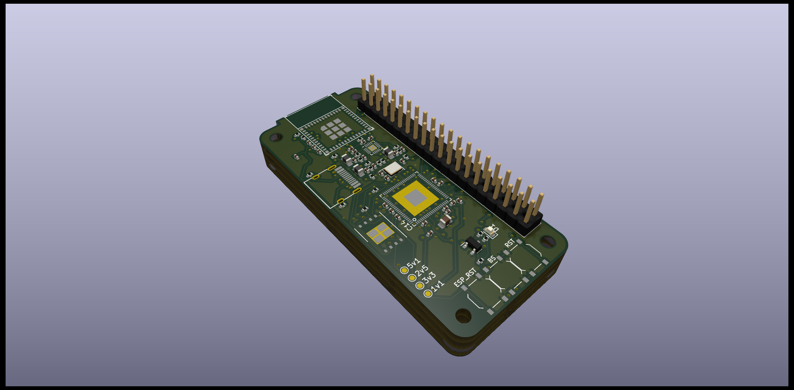
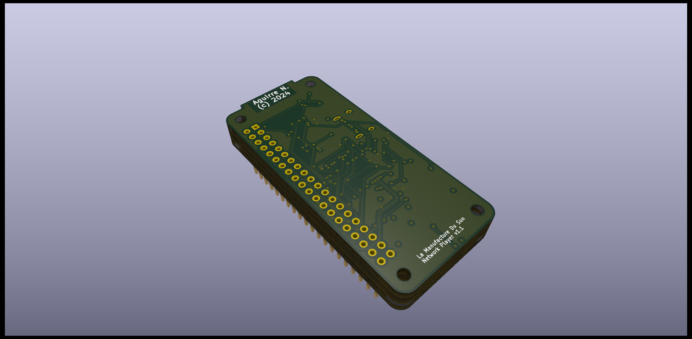

# Hardware version 1

This version of the hardware is based on 2 chips, the processor, an Allwinner f1c200s SoC and the ESP32-C3 Wifi and Bluetooth chipset fron Espressif.

## Specifications

- Allwinner f1c200s SoC
- 64MB of integrated RAM
- 128MB of SPI NAND
- ESP32-C3
- Wifi b/g/n 2.4GHz
- Bluetooth Low Energy 5.0
- 40 pins headers extension
- USB 2.0 OTG with USB-C connector
- Digital audio output (SPDIF)
- 1 LED
- 3 swith buttons for resetting the f1c200s, the ESP32-C3 and swith the f1c200s into USB bootstrap mode.
- Power 5v from the USB-C connector

## Kicad

The hardware is designed with Kicad, the schematics and the routing are available in the [hardware repository](https://github.com/naguirre/mds_hardware_v1)

Kicad version 7.x ad then 8.x was used to design the hardware.

## Schematics

The schematics are available in the [hardware repository](https://github.com/naguirre/mds_hardware_v1/blob/main/network_player/network_player.pdf)

